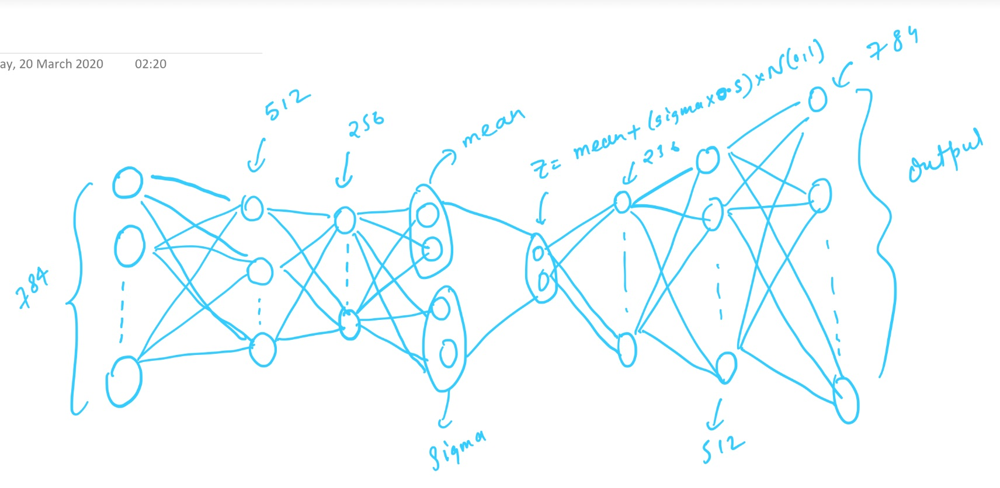

# variationalEncoder

Just as a standard autoencoder, a variational autoencoder is an architecture composed of both an encoder and a decoder and that is trained to minimise the reconstruction error between the encoded-decoded data and the initial data. However, in order to introduce some regularisation of the latent space, we proceed to a slight modification of the encoding-decoding process: instead of encoding an input as a single point, we encode it as a distribution over the latent space. The model is then trained as follows:

<ul>
  
  <li>first, the input is encoded as distribution over the latent space</li>
  <li>second, a point from the latent space is sampled from that distribution</li>
  <li>third, the sampled point is decoded and the reconstruction error can be computed</li>
  <li>finally, the reconstruction error is backpropagated through the network</li>
</ul>
 
 <h3> Architecture </h3>

